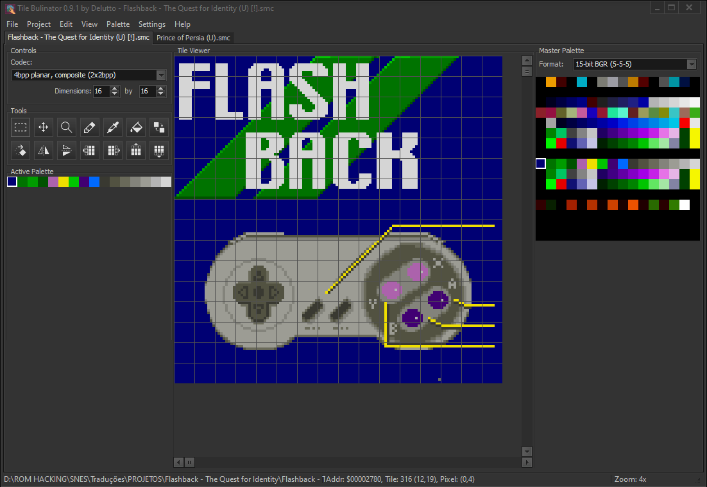

# Tile Bulinator

[](https://opensource.org/licenses/MIT)
[](https://www.embarcadero.com/products/delphi)
[](https://github.com/Delutto/Tile-Bulinator/releases)

---

## About The Project

**Tile Bulinator** is an advanced tile graphics editor, specifically designed for the visualization and modification of raw graphic data found in old console ROMs. It is heavily inspired by classic ROM Hacking tools like *Tile Layer Pro* and *Tile Molester*, aiming to provide a modern and feature-rich alternative for retro game enthusiasts and ROM hackers.

The entire application was developed in the **Delphi Community Edition 12** IDE.



## Key Features

Tile Bulinator is packed with features designed to streamline the tile editing process:

* **Advanced Tile Viewer**
    * View data with configurable tiles per row and column.
    * Smooth zooming from 1x to 16x.
    * Toggleable grid overlays for 8x8 tiles and 1x1 pixels.
    * Navigate through the file using both a tile-based vertical scroller and a byte-based horizontal scroller.
    * "Go to Offset" feature for jumping to a specific address (Hex/Dec).

* **Powerful Editing Tools**
    * **Pencil**: Draw pixel by pixel using the active color.
    * **Fill Bucket**: Fill a contiguous area within a single tile or perform a global fill across the entire view.
    * **Eyedropper**: Quickly pick a color from the tile viewer to make it the active drawing color.
    * **Color Replacer**: Replace a target color with the active color, either in the entire view or within a selection.
    * **Pointer Tool**: Select rectangular areas of tiles.
    * **Move Tool**: Move a selection of tiles to a new location.

* **Flexible Codec System**
    * Supports a wide variety of graphic formats found in retro consoles through a managed codec system.
    * **Linear Codecs**: 1bpp, 2bpp, 4bpp, 8bpp with normal or reverse bit order.
    * **Planar Codecs**: 1bpp, 2bpp, 3bpp, 4bpp, and more for systems like the Game Boy, NES, and Master System.
    * **Composite Codecs**: Handles complex formats by combining simpler ones, such as the SNES's 4bpp format (2x2bpp).

* **Palette Management**
    * Manage a 256-color master palette and an active sub-palette (e.g., 16 colors for 4bpp modes).
    * Load the master palette from the ROM at a specified offset, from an external file, or use a default grayscale palette.
    * Supports various color formats like 15-bit BGR (5-5-5) and 24-bit RGB (8-8-8).
    * Save and load active palettes to/from `.tbpal` files.

* **Standard & Modern Features**
    * Multi-level Undo/Redo system for all drawing and data modification actions.
    * Full clipboard support (Cut, Copy, Paste) for tile data.
    * Import from PNG files, automatically mapping colors to the active palette.
    * Export tile selections to a PNG file.
    * Project system to save and load your entire workspace, including all open files and their settings (`.tbproj` files).
    * Recent files and projects list for quick access.

## Supported Languages

Tile Bulinator includes support for 9 different languages.

* Català
* Deutsche
* English
* Español
* Française
* Gaeilge
* Indonesia
* Português
* Türkçe

> **Disclaimer**: These localizations were generated with the assistance of an AI. If you find any errors or wish to provide a more accurate translation, please feel free to open an issue or pull request.

## Getting Started

You can get a ready-to-use version from the releases page or compile it from the source.

### From Release

1.  Go to the project's [**Releases Page**](https://github.com/Delutto/Tile-Bulinator/releases).
2.  Download the latest `.zip` file.
3.  Extract the archive and run `TileBulinator.exe`.

### From Source

1.  Ensure you have **Delphi Community Edition 12** or a later version installed.
2.  Clone the repository:
    ```sh
    git clone [https://github.com/Delutto/Tile-Bulinator.git](https://github.com/Delutto/Tile-Bulinator.git)
    ```
3.  Open the `.dproj` file in Delphi and compile the project.

> **Disclaimer**: Comments in source code were generated by AI. If you find any errors or wish to provide a more accurate comments, please feel free to open an issue or pull request.

## Contributing

Contributions are what make the open-source community such an amazing place to learn, inspire, and create. Any contributions you make are **greatly appreciated**.

If you have a suggestion that would make this better, please fork the repo and create a pull request. You can also simply open an issue with the tag "enhancement".

1.  **Fork** the Project
2.  Create your Feature Branch (`git checkout -b feature/AmazingFeature`)
3.  Commit your Changes (`git commit -m 'Add some AmazingFeature'`)
4.  Push to the Branch (`git push origin feature/AmazingFeature`)
5.  Open a **Pull Request**

Don't forget to give the project a star! Thanks again!

### Reporting Bugs

If you encounter any bugs, please open an issue on the [GitHub Issues](https://github.com/Delutto/Tile-Bulinator/issues) page. Please provide as much detail as possible, including steps to reproduce the bug.

## License

This project is distributed under the MIT License. See the `LICENSE` file for more information.

## Acknowledgements

* Inspired by the great, classic tools: Tile Layer Pro & Tile Molester.
* The Delphi VCL framework by Embarcadero.
