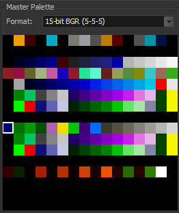

# Tile Bulinator - Manuel de l'utilisateur

Bienvenue dans le manuel de l'utilisateur officiel de **Tile Bulinator**. Ce guide fournit une présentation détaillée de toutes les fonctionnalités de l'application.

## Table des matières
1.  [Introduction](#1-introduction)
2.  [L'interface principale](#2-the-main-interface)
3.  [Pour commencer : Fichiers et Projets](#3-getting-started-files--projects)
    * [Ouvrir un fichier ROM](#opening-a-rom-file)
    * [Travailler avec des projets](#working-with-projects)
4.  [La vue de document](#4-the-document-view)
    * [Panneau de contrôles](#controls-panel)
    * [Panneau d'outils](#tools-panel)
    * [Vues de la palette](#palette-views)
    * [Le visualiseur de tuiles](#the-tile-viewer)
5.  [Les outils d'édition en détail](#5-editing-tools-in-detail)
6.  [Référence des menus](#6-menu-reference)
    * [Menu Fichier](#file-menu)
    * [Menu Édition](#edit-menu)
    * [Menu Affichage](#view-menu)
    * [Menu Palette](#palette-menu)
    * [Menu Projet](#project-menu)
    * [Menu Paramètres](#settings-menu)
7.  [Raccourcis clavier et souris](#7-keyboard--mouse-shortcuts)

---

## 1. Introduction

**Tile Bulinator** est un éditeur de graphiques de tuiles (tiles) avancé, conçu pour visualiser et modifier les données graphiques brutes trouvées dans les ROM de consoles classiques. Il fournit une interface puissante et intuitive pour les hackers de ROM et les passionnés de jeux rétro afin d'explorer et de modifier directement les ressources du jeu.

Ce manuel vous guidera à travers ses fonctionnalités puissantes, de la visualisation de base des fichiers à l'édition graphique avancée et à la gestion des palettes.

## 2. L'interface principale

La fenêtre principale est divisée en plusieurs zones clés :

*(Image : Une capture d'écran de la fenêtre principale de l'application avec les zones clés mises en évidence.)*

* **Menu principal** : Situé en haut, il donne accès à toutes les fonctions de l'application, telles que les opérations sur les fichiers, les commandes d'édition et les paramètres d'affichage.
* **Zone de document** : La partie centrale de la fenêtre où les fichiers ROM sont ouverts dans des onglets. Chaque onglet représente une vue de document indépendante.
* **Barre d'état** : Située en bas, elle affiche des informations importantes comme le chemin complet du fichier ouvert, l'adresse et les coordonnées sous le curseur, et le niveau de zoom actuel.

## 3. Pour commencer : Fichiers et Projets

### Ouvrir un fichier ROM

Pour commencer, vous devez ouvrir un fichier ROM.
1.  Allez dans **Fichier > Ouvrir** dans le menu principal.
2.  Sélectionnez un ou plusieurs fichiers ROM sur votre ordinateur.
3.  Chaque fichier sélectionné s'ouvrira dans un nouvel onglet dans la zone de document.

Lorsqu'un fichier est ouvert, il est chargé dans une **Vue de document**, qui est l'espace de travail principal pour toute l'édition.

### Travailler avec des projets

Un **Projet (`.tbproj`)** enregistre l'ensemble de votre session de travail. C'est incroyablement utile pour les hacks complexes où vous travaillez avec plusieurs fichiers ou avez des paramètres de vue très spécifiques.

Un fichier de projet stocke :
* La liste de tous les fichiers ROM ouverts.
* Les paramètres spécifiques pour chaque fichier : codec, palette, zoom, position de défilement, etc.
* L'onglet actif sur lequel vous travailliez.

Vous pouvez gérer les projets à l'aide du menu **Projet**. Utilisez **Projet > Enregistrer le projet** pour enregistrer votre session en cours et **Projet > Ouvrir le projet** pour la restaurer plus tard.

## 4. La vue de document

Chaque onglet contient une Vue de document, c'est là que toute la magie opère. Cette vue est autonome et contient tous les paramètres du fichier actuellement affiché.

*(Image : Une capture d'écran d'un seul onglet de document avec ses différents panneaux mis en évidence.)*

### Panneau de contrôles

Ce panneau vous permet de définir comment les données brutes de la ROM sont interprétées et affichées.

* **Codec** : C'est le paramètre le plus important. Un codec (abréviation de Codeur-Décodeur) indique au programme comment traduire les octets bruts de la ROM en pixels. Différentes consoles stockent les graphiques de différentes manières (par exemple, planaire, linéaire). Vous devez sélectionner le bon codec pour le jeu que vous modifiez. La liste comprend des formats comme `4bpp planar, composite (2x2bpp)` pour la SNES ou `2bpp planar` pour le Game Boy.
* **Tuiles par Ligne/Colonne** : Ces boîtes de sélection contrôlent les dimensions du visualiseur de tuiles, vous permettant d'agencer les tuiles d'une manière qui a du sens pour les données que vous visualisez.
* **Format de la palette** : Sélectionne le format de couleur pour charger les palettes depuis la ROM ou des fichiers externes (par exemple, `15-bit BGR (5-5-5)` est courant pour la SNES/GBA).

### Panneau d'outils

Ici, vous pouvez sélectionner votre outil d'édition actif et effectuer des transformations sur vos tuiles.

*(Image : Un gros plan du panneau d'outils.)*

* **Outils d'édition** : Pointeur, Crayon, Pot de peinture, Pipette, Remplaçant de couleur, Zoom et Déplacer. Chacun est expliqué en détail dans la section 5.
* **Boutons de transformation** : Retourner Horizontalement (`H`), Retourner Verticalement (`V`) et Pivoter (`R`). Ceux-ci s'appliquent à une sélection de tuiles, ou à l'ensemble de la vue si rien n'est sélectionné.
* **Boutons de décalage** : Les boutons fléchés décalent les pixels à l'intérieur de chaque tuile de la sélection (ou de l'ensemble de la vue) d'un pixel dans la direction choisie.

### Vues de la palette

Tile Bulinator utilise un système de palette à deux niveaux pour une flexibilité maximale.

* **Palette maîtresse** (panneau de droite) : Affiche la palette maîtresse complète de 256 couleurs. Vous pouvez charger cette palette depuis la ROM (voir **Menu Palette**) ou un fichier externe. Cliquer sur cette palette sélectionne une sous-palette à utiliser pour l'édition.
    
    *(Image : Un gros plan du panneau de la Palette maîtresse.)*
* **Palette active** (panneau de gauche) : C'est la sous-palette actuellement utilisée pour le dessin. Sa taille est déterminée par les bits par pixel du codec sélectionné (par exemple, un codec 4bpp utilisera une palette active de 16 couleurs). Cliquer sur une couleur ici la sélectionne pour le dessin. Un clic droit sur une couleur vous permet de la modifier.
    
    *(Image : Un gros plan du panneau de la Palette active.)*

### Le visualiseur de tuiles

C'est la toile principale où les tuiles décodées sont affichées et modifiées.

*(Image : Un gros plan du panneau du Visualiseur de tuiles.)*

* **Navigation** : Utilisez la barre de défilement verticale pour vous déplacer dans le fichier tuile par tuile, et la barre de défilement horizontale pour un décalage précis au niveau de l'octet. Vous pouvez également utiliser la molette de la souris pour faire défiler verticalement.
* **Zoom** : Le moyen le plus rapide de zoomer est de maintenir **Ctrl** et d'utiliser la **Molette de la souris**.
* **Grilles** : Vous pouvez basculer une grille de tuiles de 8x8 et une grille de pixels de 1x1 pour une édition précise via le menu **Affichage**. La grille de pixels n'est visible qu'à des niveaux de zoom plus élevés.

## 5. Les outils d'édition en détail

Voici comment utiliser chaque outil du panneau d'outils.

*  **Outil Pointeur** : Cliquez et faites glisser pour sélectionner un bloc rectangulaire de tuiles. La sélection peut ensuite être utilisée pour des transformations, des opérations de couper/copier ou d'exportation.
*  **Outil Crayon** : Cliquez sur un pixel pour dessiner avec la couleur actuellement sélectionnée dans la palette active. Vous pouvez également cliquer et faire glisser pour dessiner en continu.
    > **Raccourci** : Maintenez **Ctrl** pendant que cet outil est actif pour passer temporairement à la **Pipette**.
*  **Outil Pot de peinture** :
    * **Clic normal** : Effectue un "remplissage global". Il trouve tous les pixels de la couleur cliquée qui sont connectés sur *l'ensemble de la zone de tuiles visible* et les remplace par la couleur active.
    * **Ctrl + Clic** : Effectue un "remplissage local". Le remplissage est limité à la seule tuile de 8x8 sur laquelle vous avez cliqué.
*  **Outil Pipette** : Cliquez sur n'importe quel pixel dans le visualiseur de tuiles pour sélectionner sa couleur et en faire la couleur active dans les vues de la palette.
*  **Outil Remplaçant de couleur** : Remplace une couleur par une autre. Cliquez sur un pixel ; sa couleur devient la couleur "cible", et toutes ses instances sont remplacées par la couleur de dessin actuellement active.
    > **Raccourci** : Maintenez **Maj** en cliquant pour effectuer le remplacement *uniquement dans la sélection actuelle*.
*  **Outil Déplacer** : Vous permet de déplacer une sélection de tuiles.
    1.  D'abord, créez une sélection avec l'**Outil Pointeur**.
    2.  Sélectionnez l'**Outil Déplacer**.
    3.  Cliquez *à l'intérieur* de la sélection et faites-la glisser vers un nouvel emplacement.
    4.  Relâchez le bouton de la souris pour déposer les tuiles dans la nouvelle position.
*  **Outil Zoom** :
    * **Clic gauche** sur le visualiseur de tuiles pour zoomer en avant.
    * **Clic droit** pour zoomer en arrière.

## 6. Référence des menus

### Menu Fichier

* **Ouvrir** : Ouvre un ou plusieurs fichiers ROM.
* **Ouvrir récent** : Une liste des fichiers récemment ouverts pour un accès rapide.
* **Enregistrer** : Enregistre les modifications apportées au fichier ROM actuel.
* **Enregistrer sous...** : Enregistre le fichier ROM actuel dans un nouvel emplacement.
* **Tout enregistrer** : Enregistre tous les fichiers modifiés actuellement ouverts.
* **Fermer** : Ferme l'onglet actuel. Demandera d'enregistrer s'il y a des modifications non enregistrées.
* **Tout fermer** : Tente de fermer tous les onglets ouverts.
* **Quitter** : Ferme l'application.

### Menu Édition

* **Annuler/Rétablir** : Fonctionnalité standard d'annulation/rétablissement pour vos modifications.
* **Couper/Copier/Coller** : Copie et colle des blocs de données de tuiles sélectionnées.
* **Exporter en PNG** : Exporte la sélection de tuiles actuelle sous forme de fichier image `.png`.
* **Importer depuis PNG** : Importe un fichier `.png`. L'image est convertie à l'aide de la palette active actuelle et collée à l'emplacement de la sélection.
* **Aller à...** : Ouvre la boîte de dialogue "Aller à l'offset" pour sauter à une adresse spécifique dans le fichier.

### Menu Affichage

* **Grille de tuiles** : Active/désactive la visibilité de la grille de tuiles 8x8.
* **Grille de pixels** : Active/désactive la visibilité de la grille de pixels 1x1.

### Menu Palette

* **Charger la palette maîtresse depuis la ROM...** : Demande un offset, puis tente de charger une palette de 256 couleurs à partir de cette adresse dans la ROM en utilisant le format de palette sélectionné.
* **Charger la palette maîtresse depuis un fichier...** : Charge une palette maîtresse à partir d'un fichier externe (par exemple, un fichier `.pal`).
* **Charger la palette active depuis un fichier...** : Charge une petite palette directement dans la vue de la palette active à partir d'un fichier `.tbpal`.
* **Enregistrer la palette active...** : Enregistre la palette active actuelle dans un fichier `.tbpal`.

### Menu Projet

* **Nouveau projet** : Ferme tous les fichiers ? démarre une nouvelle session de projet vide.
* **Ouvrir le projet...** : Ouvre un fichier `.tbproj`, restaurant tous les fichiers enregistrés et leurs paramètres.
* **Ouvrir un projet récent** : Une liste des projets récemment ouverts.
* **Enregistrer le projet / Enregistrer le projet sous...** : Enregistre l'état actuel de tous les onglets ouverts et leurs paramètres dans un fichier `.tbproj`.
* **Fermer le projet** : Ferme le projet actuel (fonctionnellement identique à Nouveau projet).

### Menu Paramètres

* **Paramètres...** : Ouvre la boîte de dialogue des paramètres de l'application, où vous pouvez changer la langue, les vues par défaut et l'apparence de la sélection.

## 7. Raccourcis clavier et souris

| Action | Raccourci | Contexte |
| :--- | :--- | :--- |
| Zoom | `Ctrl` + `Molette de la souris` | Dans le visualiseur de tuiles |
| Défilement vertical | `Molette de la souris` | Dans le visualiseur de tuiles |
| Pipette temporaire | `Ctrl` + `Clic` | Lorsque l'outil Crayon est actif |
| Remplissage de tuile local | `Ctrl` + `Clic` | Lorsque l'outil Pot de peinture est actif |
| Remplacer dans la sélection | `Maj` + `Clic` | Lorsque le Remplaçant de couleur est actif |
| Modifier la couleur active | `Clic droit` sur une couleur | Dans la vue de la palette active |

---
*Ce manuel a été généré par IA sur la base du code source de l'application. Toutes les fonctionnalités sont sujettes à modification.*