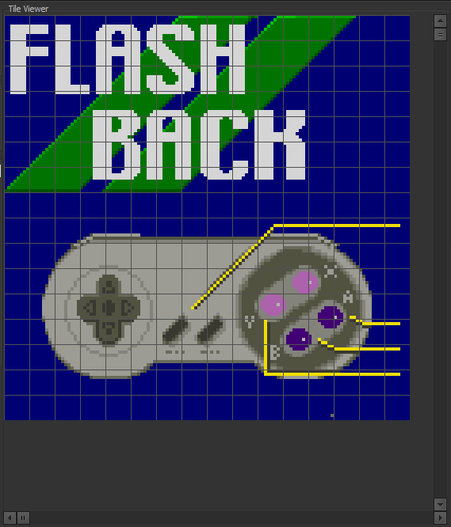

# Tile Bulinator - Lámhleabhar Úsáideora

Fáilte go dtí an Lámhleabhar Úsáideora oifigiúil le haghaidh **Tile Bulinator**. Soláthraíonn an treoir seo siúl tríd mionsonraithe ar ghnéithe agus ar fheidhmiúlachtaí uile an fheidhmchláir.

## Clár na nÁbhar
1.  [Réamhrá](#1-introduction)
2.  [An Príomh-Chomhéadan](#2-the-main-interface)
3.  [Ag Tosú: Comhaid & Tionscadail](#3-getting-started-files--projects)
    * [Comhad ROM a Oscailt](#opening-a-rom-file)
    * [Ag Obair le Tionscadail](#working-with-projects)
4.  [Amharc an Doiciméid](#4-the-document-view)
    * [Painéal na Rialuithe](#controls-panel)
    * [Painéal na nUirlisí](#tools-panel)
    * [Amhairc na bPailéad](#palette-views)
    * [Amharcán na dTíleanna](#the-tile-viewer)
5.  [Uirlisí Eagarthóireachta go Mion](#5-editing-tools-in-detail)
6.  [Tagairt na Roghchlár](#6-menu-reference)
    * [An Roghchlár 'Comhad'](#file-menu)
    * [An Roghchlár 'Eagar'](#edit-menu)
    * [An Roghchlár 'Amharc'](#view-menu)
    * [An Roghchlár 'Pailéad'](#palette-menu)
    * [An Roghchlár 'Tionscadal'](#project-menu)
    * [An Roghchlár 'Socruithe'](#settings-menu)
7.  [Aicearraí Méarchláir & Luiche](#7-keyboard--mouse-shortcuts)

---

## 1. Réamhrá

Is eagarthóir grafaicí tíleanna casta é **Tile Bulinator** atá deartha chun sonraí grafaicí amha a fhaightear i ROManna consól clasaiceach a fheiceáil agus a mhodhnú. Soláthraíonn sé comhéadan cumhachtach agus iomasach do haceálaithe ROM agus do dhíograiseoirí cluichí retro chun sócmhainní cluiche a fhiosrú agus a athrú go díreach.

Tabharfaidh an lámhleabhar seo treoir duit trína ghnéithe cumhachtacha, ó amharc bunúsach ar chomhaid go heagarthóireacht ghrafaice chun cinn agus bainistíocht pailéad.

## 2. An Príomh-Chomhéadan

Tá an phríomhfhuinneog roinnte i roinnt príomhréimsí:

*(Íomhá: Gabháil scáileáin de phríomhfhuinneog an fheidhmchláir le príomhréimsí aibhsithe.)*

* **An Príomh-Roghchlár**: Suite ag an mbarr, soláthraíonn sé rochtain ar fheidhmeanna uile an fheidhmchláir, mar shampla oibríochtaí comhaid, orduithe eagarthóireachta, agus socruithe amhairc.
* **Limistéar na nDoiciméad**: Cuid lárnach na fuinneoige ina n-osclaítear comhaid ROM i gcluaisíní. Léiríonn gach cluaisín amharc neamhspleách doiciméid.
* **An Barra Stádais**: Suite ag an mbun, taispeánann sé faisnéis thábhachtach mar chonair iomlán an chomhaid oscailte, an seoladh agus na comhordanáidí faoin gcúrsóir, agus an leibhéal zúmála reatha.

## 3. Ag Tosú: Comhaid & Tionscadail

### Comhad ROM a Oscailt

Chun tús a chur leis, ní mór duit comhad ROM a oscailt.
1.  Téigh go **Comhad > Oscail** sa phríomh-roghchlár.
2.  Roghnaigh comhad ROM amháin nó níos mó ó do ríomhaire.
3.  Osclófar gach comhad roghnaithe i gcluaisín nua i Limistéar na nDoiciméad.

Nuair a osclaítear comhad, lódáiltear é isteach in **Amharc an Doiciméid**, arb é an príomh-spás oibre é don eagarthóireacht ar fad.

### Ag Obair le Tionscadail

Sábhálann **Tionscadal (`.tbproj`)** do sheisiún oibre iomlán. Tá sé seo thar a bheith úsáideach le haghaidh haceanna casta ina bhfuil tú ag obair le comhaid iolracha nó ina bhfuil socruithe amhairc an-sonrach agat.

Stórálann comhad tionscadail:
* Liosta na gcomhad ROM go léir atá oscailte.
* Na socruithe sonracha do gach comhad: codec, pailéad, zúmáil, suíomh scrollaigh, srl.
* An cluaisín gníomhach a raibh tú ag obair air.

Is féidir leat tionscadail a bhainistiú ag baint úsáide as an roghchlár **Tionscadal**. Úsáid **Tionscadal > Sábháil Tionscadal** chun do sheisiún reatha a shábháil agus **Tionscadal > Oscail Tionscadal** chun é a athbhunú níos déanaí.

## 4. Amharc an Doiciméid

Tá Amharc an Doiciméid i ngach cluaisín, áit a dtarlaíonn an draíocht ar fad. Tá an t-amharc seo féinchuimsitheach agus coinníonn sé na socruithe go léir don chomhad atá á thaispeáint faoi láthair.

*(Íomhá: Gabháil scáileáin de chluaisín doiciméid aonair lena phainéil éagsúla aibhsithe.)*

### Painéal na Rialuithe

Ligeann an painéal seo duit sainmhíniú a dhéanamh ar an gcaoi a ndéantar na sonraí amha ón ROM a léirmhíniú agus a thaispeáint.

* **Codec**: Seo an socrú is tábhachtaí. Insíonn codec (giorrúchán ar Ionchódóir-Díchódóir) don chlár conas bearta amha an ROM a aistriú go picteilíní. Stórálann consóil éagsúla grafaicí ar bhealaí éagsúla (m.sh., plánach, líneach). Caithfidh tú an codec ceart a roghnú don chluiche atá á chur in eagar agat. Áirítear ar an liosta formáidí mar `4bpp planar, composite (2x2bpp)` don SNES nó `2bpp planar` don Game Boy.
* **Tíleanna in aghaidh an Ró/an Cholúin**: Rialaíonn na boscaí casadh seo toisí an amharcáin tíleanna, rud a ligeann duit na tíleanna a shocrú ar bhealach a bhfuil ciall leis do na sonraí atá á bhfeiceáil agat.
* **Formáid an Phailéid**: Roghnaíonn sé an fhormáid datha chun pailéid a luchtú ón ROM nó ó chomhaid sheachtracha (m.sh., tá `15-bit BGR (5-5-5)` coitianta don SNES/GBA).

### Painéal na nUirlisí

Anseo is féidir leat d'uirlis eagarthóireachta gníomhach a roghnú agus claochluithe a dhéanamh ar do thíleanna.

                                                                                       
*(Íomhá: Gar-amharc ar phainéal na nUirlisí.)*

* **Uirlisí Eagarthóireachta**: Pointeoir, Peann luaidhe, Buicéad Líonta, Sileadóir, Ionadaí Datha, Zúmáil, agus Bog. Mínítear gach ceann acu go mion i roinn 5.
* **Cnaipí Claochlaithe**: Smeach go Cothrománach (`H`), Smeach go Ceartingearach (`V`), agus Rothlaigh (`R`). Baineann siad seo le roghnú tíleanna, nó leis an amharc iomlán mura bhfuil aon rud roghnaithe.
* **Cnaipí Aistrithe**: Aistríonn na cnaipí saighde na picteilíní laistigh de gach tíl den roghnú (nó an t-amharc iomlán) picteilín amháin sa treo roghnaithe.

### Amhairc na bPailéad

Úsáideann Tile Bulinator córas pailéad dhá leibhéal don tsolúbthacht is mó.

* **An Mháistir-Phailéad** (painéal ar dheis): Taispeánann sé an mháistir-phailéad iomlán 256-dath. Is féidir leat an pailéad seo a lódáil ón ROM (féach **An Roghchlár 'Pailéad'**) nó ó chomhad seachtrach. Má chliceálann tú ar an bpailéad seo, roghnaítear fo-phailéad le húsáid le haghaidh eagarthóireachta.

                                                                                           
    *(Íomhá: Gar-amharc ar phainéal na Máistir-Phailéide.)*
* **An Pailéad Gníomhach** (painéal ar chlé): Seo an fo-phailéad atá á úsáid faoi láthair le haghaidh líníochta. Cinntear a mhéid de réir ghiotáin-in aghaidh-an-phicteilín an codec roghnaithe (m.sh., úsáidfidh codec 4bpp pailéad gníomhach 16-dath). Má chliceálann tú ar dhath anseo, roghnaítear é le haghaidh líníochta. Ligeann cliceáil ar dheis ar dhath duit é a chur in eagar.

                                                                                                           
    *(Íomhá: Gar-amharc ar phainéal an Phailéid Ghníomhaigh.)*

### Amharcán na dTíleanna

Seo an príomhchanbhás ina dtaispeántar agus ina gcuirtear na tíleanna díchódaithe in eagar.

                                                                                                       
*(Íomhá: Gar-amharc ar phainéal Amharcán na dTíleanna.)*

* **Nascleanúint**: Úsáid an barra scrollaigh ceartingearach chun bogadh tríd an gcomhad tíl ar thíl, agus an barra scrollaigh cothrománach le haghaidh fritháireamh beacht ar leibhéal an bhirt. Is féidir leat roth na luiche a úsáid freisin chun scrollú go ceartingearach.
* **Zúmáil**: Is é an bealach is tapúla chun zúmáil ná **Ctrl** a choinneáil síos agus **Roth na Luiche** a úsáid.
* **Eangaí**: Is féidir leat eangach tíleanna 8x8 agus eangach picteilíní 1x1 a scoránú le haghaidh eagarthóireacht bheacht tríd an roghchlár **Amharc**. Níl an eangach picteilíní le feiceáil ach amháin ag leibhéil zúmála níos airde.

## 5. Uirlisí Eagarthóireachta go Mion

Seo mar a úsáidtear gach uirlis ó Phainéal na nUirlisí.

*  **An tUirlis Pointeora**: Cliceáil agus tarraing chun bloc dronuilleogach tíleanna a roghnú. Is féidir an roghnú a úsáid ansin le haghaidh claochluithe, oibríochtaí gearrtha/cóipeála, nó easpórtála.
*  **An tUirlis Pinn Luaidhe**: Cliceáil ar phicteilín chun líníocht a dhéanamh leis an dath atá roghnaithe faoi láthair ón bPailéad Gníomhach. Is féidir leat cliceáil agus tarraingt freisin chun líníocht a dhéanamh go leanúnach.
    > **Aicearra**: Coinnigh **Ctrl** síos agus an uirlis seo gníomhach chun aistriú go sealadach chuig an **Sileadóir**.
*  **An tUirlis Buicéid Líonta**:
    * **Gnáthchliceáil**: Déanann sé "líonadh domhanda". Faigheann sé gach picteilín den dath cliceáilte atá nasctha ar fud an *limistéir tíleanna infheicthe iomláin* agus cuireann sé an dath gníomhach ina n-ionad.
    * **Ctrl + Cliceáil**: Déanann sé "líonadh áitiúil". Tá an líonadh teoranta don tíl aonair 8x8 ar chliceáil tú air.
*  **An tUirlis Sileadóra**: Cliceáil ar aon phicteilín san amharcán tíleanna chun a dhath a roghnú agus é a dhéanamh mar an dath gníomhach sna hamhairc pailéad.
*  **An tUirlis Ionadaí Datha**: Cuireann sé dath eile in ionad datha. Cliceáil ar phicteilín; déantar a dhath mar an dath "sprioc", agus cuirtear an dath líníochta gníomhach reatha in ionad gach cás de.
    > **Aicearra**: Coinnigh **Shift** síos agus tú ag cliceáil chun an t-ionadú a dhéanamh *laistigh den roghnú reatha amháin*.
*  **An tUirlis Bogtha**: Ligeann sé duit roghnú tíleanna a bhogadh.
    1.  Ar dtús, cruthaigh roghnú leis an **Uirlis Pointeora**.
    2.  Roghnaigh an **Uirlis Bogtha**.
    3.  Cliceáil *laistigh* den roghnú agus tarraing go suíomh nua é.
    4.  Scaoil cnaipe na luiche chun na tíleanna a ligean anuas sa suíomh nua.
*  **An tUirlis Zúmála**:
    * **Cliceáil ar chlé** ar an amharcán tíleanna chun zúmáil isteach.
    * **Cliceáil ar dheis** chun zúmáil amach.

## 6. Tagairt na Roghchlár

### An Roghchlár 'Comhad'

* **Oscail**: Osclaíonn sé comhad ROM amháin nó níos mó.
* **Oscail le Déanaí**: Liosta de na comhaid a osclaíodh le déanaí le haghaidh rochtain thapa.
* **Sábháil**: Sábhálann sé na hathruithe ar an gcomhad ROM reatha.
* **Sábháil Mar...**: Sábhálann sé an comhad ROM reatha go suíomh nua.
* **Sábháil Gach Rud**: Sábhálann sé gach comhad modhnaithe atá oscailte faoi láthair.
* **Dún**: Dúnann sé an cluaisín reatha. Iarrfaidh sé ort sábháil má tá athruithe neamhshábháilte ann.
* **Dún Gach Rud**: Déanann sé iarracht na cluaisíní oscailte go léir a dhúnadh.
* **Scoir**: Dúnann sé an feidhmchlár.

### An Roghchlár 'Eagar'

* **Cealaigh/Athdhéan**: Feidhmiúlacht chaighdeánach cealaithe/athdhéanta do d'eagarthóireacht.
* **Gearr/Cóipeáil/Greamaigh**: Cóipeálann agus greamaíonn sé bloic de shonraí tíleanna roghnaithe.
* **Easpórtáil go PNG**: Easpórtálann sé an roghnú tíleanna reatha mar chomhad íomhá `.png`.
* **Iompórtáil ó PNG**: Iompórtálann sé comhad `.png`. Déantar an íomhá a thiontú ag baint úsáide as an bpailéad gníomhach reatha agus greamaítear í ag suíomh an roghnaithe.
* **Téigh go...**: Osclaíonn sé an dialóg "Téigh go Fritháireamh" chun léim go seoladh sonrach sa chomhad.

### An Roghchlár 'Amharc'

* **Eangach Tíleanna**: Scoránaíonn sé infheictheacht na heangaí tíleanna 8x8.
* **Eangach Picteilíní**: Scoránaíonn sé infheictheacht na heangaí picteilíní 1x1.

### An Roghchlár 'Pailéad'

* **Luchtaigh an Mháistir-Phailéad ón ROM...**: Iarrann sé fritháireamh, ansin déanann sé iarracht pailéad 256-dath a lódáil ón seoladh sin sa ROM ag baint úsáide as an bhFormáid Pailéid roghnaithe.
* **Luchtaigh an Mháistir-Phailéad ó Chomhad...**: Luchtaíonn sé máistir-phailéad ó chomhad seachtrach (m.sh., comhad `.pal`).
* **Luchtaigh an Pailéad Gníomhach ó Chomhad...**: Luchtaíonn sé pailéad beag go díreach isteach san amharc Pailéad Gníomhach ó chomhad `.tbpal`.
* **Sábháil an Pailéad Gníomhach...**: Sábhálann sé an Pailéad Gníomhach reatha go comhad `.tbpal`.

### An Roghchlár 'Tionscadal'

* **Tionscadal Nua**: Dúnann sé gach comhad agus tosaíonn sé seisiún tionscadail nua, folamh.
* **Oscail Tionscadal...**: Osclaíonn sé comhad `.tbproj`, ag athbhunú na gcomhad sábháilte go léir agus a gcuid socruithe.
* **Oscail Tionscadal le Déanaí**: Liosta de na tionscadail a osclaíodh le déanaí.
* **Sábháil Tionscadal / Sábháil Tionscadal Mar...**: Sábhálann sé staid reatha na gcluaisíní oscailte go léir agus a gcuid socruithe i gcomhad `.tbproj`.
* **Dún Tionscadal**: Dúnann sé an tionscadal reatha (feidhmiúil mar an gcéanna le Tionscadal Nua).

### An Roghchlár 'Socruithe'

* **Socruithe...**: Osclaíonn sé dialóg socruithe an fheidhmchláir, áit ar féidir leat an teanga, na hamhairc réamhshocraithe, agus cuma an roghnaithe a athrú.

## 7. Aicearraí Méarchláir & Luiche

| Gníomh | Aicearra | Comhthéacs |
| :--- | :--- | :--- |
| Zúmáil | `Ctrl` + `Roth na Luiche` | In Amharcán na dTíleanna |
| Scrollú Ceartingearach | `Roth na Luiche` | In Amharcán na dTíleanna |
| Sileadóir Sealadach | `Ctrl` + `Cliceáil` | Nuair atá an Uirlis Pinn Luaidhe gníomhach |
| Líonadh Tíle Áitiúil | `Ctrl` + `Cliceáil` | Nuair atá an Uirlis Buicéid Líonta gníomhach |
| Ionadaigh sa Roghnú | `Shift` + `Cliceáil` | Nuair atá an tIonadaí Datha gníomhach |
| Cuir an Dath Gníomhach in Eagar | `Cliceáil ar dheis` ar dhath | In Amharc an Phailéid Ghníomhaigh |

---

*Ghintear an lámhleabhar seo le AI bunaithe ar chód foinse an fheidhmchláir. Tá gach gné faoi réir athraithe.*
