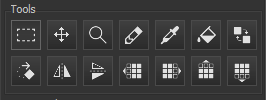

# Tile Bulinator - Panduan Pengguna

Selamat datang di Panduan Pengguna resmi untuk **Tile Bulinator**. Panduan ini menyediakan penelusuran mendetail tentang semua fitur dan fungsionalitas aplikasi.

## Daftar Isi
1.  [Pendahuluan](#1-introduction)
2.  [Antarmuka Utama](#2-the-main-interface)
3.  [Memulai: File & Proyek](#3-getting-started-files--projects)
    * [Membuka File ROM](#opening-a-rom-file)
    * [Bekerja dengan Proyek](#working-with-projects)
4.  [Tampilan Dokumen](#4-the-document-view)
    * [Panel Kontrol](#controls-panel)
    * [Panel Alat](#tools-panel)
    * [Tampilan Palet](#palette-views)
    * [Penampil Tile](#the-tile-viewer)
5.  [Detail Alat Penyuntingan](#5-editing-tools-in-detail)
6.  [Referensi Menu](#6-menu-reference)
    * [Menu File](#file-menu)
    * [Menu Edit](#edit-menu)
    * [Menu Tampilan](#view-menu)
    * [Menu Palet](#palette-menu)
    * [Menu Proyek](#project-menu)
    * [Menu Pengaturan](#settings-menu)
7.  [Pintasan Keyboard & Mouse](#7-keyboard--mouse-shortcuts)

---

## 1. Pendahuluan

**Tile Bulinator** adalah editor grafis tile canggih yang dirancang untuk melihat dan memodifikasi data grafis mentah yang ditemukan di ROM konsol klasik. Ini menyediakan antarmuka yang kuat dan intuitif bagi para peretas ROM dan penggemar game retro untuk menjelajahi dan mengubah aset game secara langsung.

Panduan ini akan memandu Anda melalui fitur-fitur canggihnya, dari melihat file dasar hingga penyuntingan grafis dan manajemen palet tingkat lanjut.

## 2. Antarmuka Utama

Jendela utama dibagi menjadi beberapa area utama:

*(Gambar: Screenshot jendela aplikasi utama dengan area-area kunci yang disorot.)*

* **Menu Utama**: Terletak di bagian atas, menyediakan akses ke semua fungsi aplikasi, seperti operasi file, perintah penyuntingan, dan pengaturan tampilan.
* **Area Dokumen**: Bagian tengah jendela tempat file ROM dibuka dalam tab. Setiap tab mewakili tampilan dokumen yang independen.
* **Bilah Status**: Terletak di bagian bawah, menampilkan informasi penting seperti path lengkap file yang terbuka, alamat dan koordinat di bawah kursor, dan tingkat zoom saat ini.

## 3. Memulai: File & Proyek

### Membuka File ROM

Untuk memulai, Anda perlu membuka file ROM.
1.  Buka **File > Buka** di menu utama.
2.  Pilih satu ??? lebih file ROM dari komputer Anda.
3.  Setiap file yang dipilih akan terbuka di tab baru di Area Dokumen.

Ketika sebuah file dibuka, file tersebut dimuat ke dalam **Tampilan Dokumen**, yang merupakan ruang kerja utama untuk semua penyuntingan.

### Bekerja dengan Proyek

Sebuah **Proyek (`.tbproj`)** menyimpan seluruh sesi ruang kerja Anda. Ini sangat berguna untuk peretasan kompleks di mana Anda bekerja dengan banyak file atau memiliki pengaturan tampilan yang sangat spesifik.

Sebuah file proyek menyimpan:
* Daftar semua file ROM yang terbuka.
* Pengaturan spesifik ??? setiap file: codec, palet, zoom, posisi gulir, dll.
* Tab aktif tempat Anda bekerja.

Anda dapat mengelola proyek menggunakan menu **Proyek**. Gunakan **Proyek > Simpan Proyek** untuk menyimpan sesi Anda saat ini dan **Proyek > Buka Proyek** untuk memulihkannya nanti.

## 4. Tampilan Dokumen

Setiap tab berisi Tampilan Dokumen, di mana semua keajaiban terjadi. Tampilan ini mandiri dan menampung semua pengaturan untuk file yang sedang ditampilkan.

*(Gambar: Screenshot dari satu tab dokumen dengan berbagai panelnya yang disorot.)*

### Panel Kontrol

Panel ini memungkinkan Anda untuk menentukan bagaimana data mentah dari ROM diinterpretasikan dan ditampilkan.

* **Codec**: Ini adalah pengaturan yang paling penting. Sebuah codec (singkatan dari Coder-Decoder) memberitahu program bagaimana menerjemahkan byte mentah dari ROM menjadi piksel. Konsol yang berbeda menyimpan grafis dengan cara yang berbeda (misalnya, planar, linear). Anda harus memilih codec yang benar untuk game yang Anda edit. Daftar ini mencakup format seperti `4bpp planar, composite (2x2bpp)` untuk SNES atau `2bpp planar` untuk Game Boy.
* **Tile per Baris/Kolom**: Kotak isian ini mengontrol dimensi penampil tile, memungkinkan Anda untuk mengatur tile dengan cara yang masuk akal untuk data yang Anda lihat.
* **Format Palet**: Memilih format warna untuk memuat palet dari ROM atau file eksternal (misalnya, `15-bit BGR (5-5-5)` umum untuk SNES/GBA).

### Panel Alat

Di sini Anda dapat memilih alat penyuntingan aktif Anda dan melakukan transformasi pada tile Anda.

*(Gambar: Tampilan dekat dari panel Alat.)*

* **Alat Penyuntingan**: Penunjuk, Pensil, Ember Isi, Pipet, Pengganti Warna, Zoom, dan Pindah. Masing-masing dijelaskan secara detail di bagian 5.
* **Tombol Transformasi**: Balik Horizontal (`H`), Balik Vertikal (`V`), dan Putar (`R`). Ini berlaku untuk pilihan tile, atau seluruh tampilan jika tidak ada yang dipilih.
* **Tombol Geser**: Tombol panah menggeser piksel di dalam setiap tile dari pilihan (atau seluruh tampilan) sebesar satu piksel ke arah yang dipilih.

### Tampilan Palet

Tile Bulinator menggunakan sistem palet dua tingkat untuk fleksibilitas maksimum.

* **Palet Master** (panel kanan): Ini menunjukkan palet master 256 warna penuh. Anda dapat memuat palet ini dari ROM (lihat **Menu Palet**) atau file eksternal. Mengklik palet ini memilih sub-palet untuk digunakan dalam penyuntingan.
    
    *(Gambar: Tampilan dekat dari panel Palet Master.)*
* **Palet Aktif** (panel kiri): Ini adalah sub-palet yang saat ini digunakan ??? menggambar. Ukurannya ditentukan oleh bit-per-piksel dari codec yang dipilih (misalnya, codec 4bpp akan menggunakan palet aktif 16 warna). Mengklik warna di sini memilihnya untuk menggambar. Klik kanan pada warna memungkinkan Anda untuk mengeditnya.
    
    *(Gambar: Tampilan dekat dari panel Palet Aktif.)*

### Penampil Tile

Ini adalah kanvas utama tempat tile yang telah didekodekan ditampilkan dan diedit.

*(Gambar: Tampilan dekat dari panel Penampil Tile.)*

* **Navigasi**: Gunakan bilah gulir vertikal untuk bergerak melalui file tile-demi-tile, dan bilah gulir horizontal untuk penyesuaian offset tingkat byte yang lebih halus. Anda juga bisa menggunakan roda mouse untuk menggulir secara vertikal.
* **Zoom**: Cara tercepat untuk melakukan zoom adalah dengan menahan **Ctrl** dan menggunakan **Roda Mouse**.
* **Kisi**: Anda dapat mengaktifkan/menonaktifkan kisi tile 8x8 dan kisi piksel 1x1 untuk penyuntingan yang presisi melalui menu **Tampilan**. Kisi piksel hanya terlihat pada tingkat zoom yang lebih tinggi.

## 5. Detail Alat Penyuntingan

Berikut adalah cara menggunakan setiap alat dari Panel Alat.

*  **Alat Penunjuk**: Klik dan seret untuk memilih blok tile persegi panjang. Pilihan tersebut kemudian dapat digunakan untuk transformasi, operasi potong/salin, atau ekspor.
*  **Alat Pensil**: Klik pada piksel untuk menggambar dengan warna yang saat ini dipilih dari Palet Aktif. Anda juga dapat mengklik dan menyeret untuk menggambar secara terus-menerus.
    > **Pintasan**: Tahan **Ctrl** saat alat ini aktif untuk beralih sementara ke **Pipet**.
*  **Alat Ember Isi**:
    * **Klik Normal**: Melakukan "pengisian global". Ini menemukan semua piksel dari warna yang diklik yang terhubung di *seluruh area tile yang terlihat* dan menggantinya dengan warna aktif.
    * **Ctrl + Klik**: Melakukan "pengisian lokal". Pengisian dibatasi pada satu tile 8x8 tempat Anda mengklik.
*  **Alat Pipet**: Klik pada piksel mana pun di penampil tile untuk memilih warnanya dan menjadikannya warna aktif di tampilan palet.
*  **Alat Pengganti Warna**: Mengganti satu warna dengan warna lain. Klik pada sebuah piksel; warnanya menjadi warna "target", dan semua contohnya diganti dengan warna gambar yang saat ini aktif.
    > **Pintasan**: Tahan **Shift** saat mengklik untuk melakukan penggantian *hanya di dalam pilihan saat ini*.
*  **Alat Pindah**: Memungkinkan Anda untuk memindahkan pilihan tile.
    1.  Pertama, buat pilihan dengan **Alat Penunjuk**.
    2.  Pilih **Alat Pindah**.
    3.  Klik *di dalam* pilihan dan seret ke lokasi baru.
    4.  Lepaskan tombol mouse untuk menempatkan tile di posisi baru.
*  **Alat Zoom**:
    * **Klik kiri** pada penampil tile untuk memperbesar (zoom in).
    * **Klik kanan** untuk memperkecil (zoom out).

## 6. Referensi Menu

### Menu File

* **Buka**: Membuka satu atau lebih file ROM.
* **Buka Terbaru**: Daftar file yang baru saja dibuka untuk akses cepat.
* **Simpan**: Menyimpan perubahan ke file ROM saat ini.
* **Simpan Sebagai...**: Menyimpan file ROM saat ini ke lokasi baru.
* **Simpan Semua**: Menyimpan semua file yang diubah yang saat ini terbuka.
* **Tutup**: Menutup tab saat ini. Akan meminta untuk menyimpan jika ada perubahan yang belum disimpan.
* **Tutup Semua**: Mencoba menutup semua tab yang terbuka.
* **Keluar**: Menutup aplikasi.

### Menu Edit

* **Urung/Ulang**: Fungsionalitas urung/ulang standar untuk editan Anda.
* **Potong/Salin/Tempel**: Menyalin dan menempel blok data tile yang dipilih.
* **Ekspor ke PNG**: Mengekspor pilihan tile saat ini sebagai file gambar `.png`.
* **Impor dari PNG**: Mengimpor file `.png`. Gambar dikonversi menggunakan palet aktif saat ini dan ditempel di lokasi pilihan.
* **Pergi Ke...**: Membuka dialog "Pergi ke Offset" untuk melompat ke alamat tertentu dalam file.

### Menu Tampilan

* **Kisi Tile**: Mengaktifkan/menonaktifkan visibilitas kisi tile 8x8.
* **Kisi Piksel**: Mengaktifkan/menonaktifkan visibilitas kisi piksel 1x1.

### Menu Palet

* **Muat Palet Master dari ROM...**: Meminta offset, kemudian mencoba memuat palet 256 warna dari alamat tersebut di ROM menggunakan Format Palet yang dipilih.
* **Muat Palet Master dari File...**: Memuat palet master dari file eksternal (misalnya, file `.pal`).
* **Muat Palet Aktif dari File...**: Memuat palet kecil langsung ke tampilan Palet Aktif dari file `.tbpal`.
* **Simpan Palet Aktif...**: Menyimpan Palet Aktif saat ini ke file `.tbpal`.

### Menu Proyek

* **Proyek Baru**: Menutup semua file dan memulai sesi proyek baru yang kosong.
* **Buka Proyek...**: Membuka file `.tbproj`, memulihkan semua file yang disimpan dan pengaturannya.
* **Buka Proyek Terbaru**: Daftar proyek yang baru saja dibuka.
* **Simpan Proyek / Simpan Proyek Sebagai...**: Menyimpan status saat ini dari semua tab yang terbuka dan pengaturannya ke dalam file `.tbproj`.
* **Tutup Proyek**: Menutup proyek saat ini (secara fungsional sama dengan Proyek Baru).

### Menu Pengaturan

* **Pengaturan...**: Membuka dialog pengaturan aplikasi, di mana Anda dapat mengubah bahasa, tampilan default, dan penampilan pilihan.

## 7. Pintasan Keyboard & Mouse

| Aksi | Pintasan | Konteks |
| :--- | :--- | :--- |
| Zoom | `Ctrl` + `Roda Mouse` | Di Penampil Tile |
| Gulir Vertikal | `Roda Mouse` | Di Penampil Tile |
| Pipet Sementara | `Ctrl` + `Klik` | Saat Alat Pensil aktif |
| Isi Tile Lokal | `Ctrl` + `Klik` | Saat Alat Ember Isi aktif |
| Ganti dalam Pilihan | `Shift` + `Klik` | Saat Pengganti Warna aktif |
| Edit Warna Aktif | `Klik kanan` pada warna | Di Tampilan Palet Aktif |

---
*Panduan ini dibuat oleh AI berdasarkan kode sumber aplikasi. Semua fitur dapat berubah.*