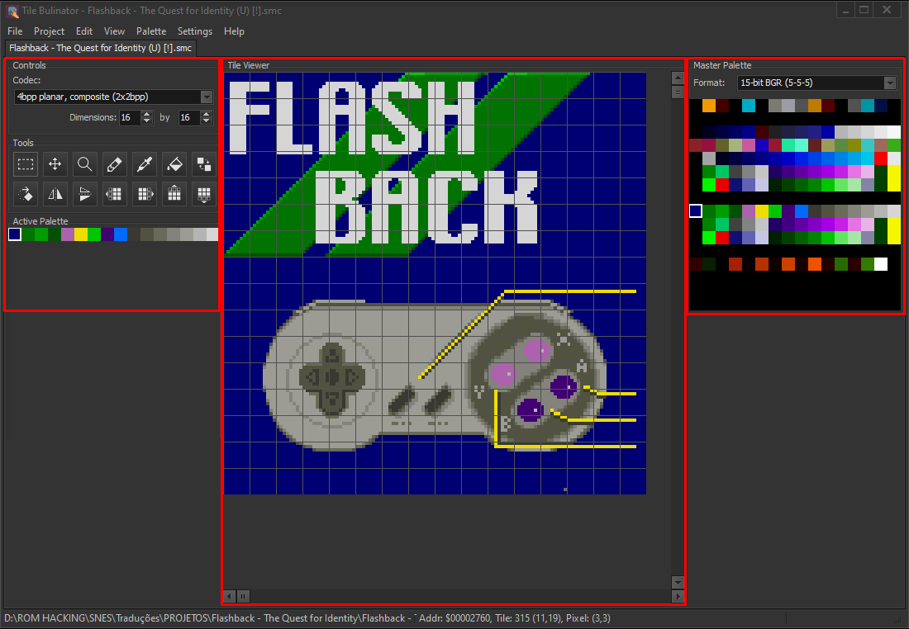

# Tile Bulinator - Manuale Utente

Benvenuti nel Manuale Utente ufficiale di **Tile Bulinator**. Questa guida fornisce una procedura dettagliata di tutte le caratteristiche e funzionalità dell'applicazione.

## Indice
1.  [Introduzione](#1-introduction)
2.  [L'interfaccia principale](#2-the-main-interface)
3.  [Primi passi: File e Progetti](#3-getting-started-files--projects)
    * [Aprire un file ROM](#opening-a-rom-file)
    * [Lavorare con i progetti](#working-with-projects)
4.  [La vista documento](#4-the-document-view)
    * [Pannello di controllo](#controls-panel)
    * [Pannello degli strumenti](#tools-panel)
    * [Viste della palette](#palette-views)
    * [Il visualizzatore di tasselli](#the-tile-viewer)
5.  [Gli strumenti di modifica in dettaglio](#5-editing-tools-in-detail)
6.  [Riferimento dei menu](#6-menu-reference)
    * [Menu File](#file-menu)
    * [Menu Modifica](#edit-menu)
    * [Menu Visualizza](#view-menu)
    * [Menu Palette](#palette-menu)
    * [Menu Progetto](#project-menu)
    * [Menu Impostazioni](#settings-menu)
7.  [Scorciatoie da tastiera e mouse](#7-keyboard--mouse-shortcuts)

---

## 1. Introduzione

**Tile Bulinator** è un editor grafico avanzato per tasselli (tile), progettato per visualizzare e modificare dati grafici grezzi presenti nelle ROM delle console classiche. Fornisce un'interfaccia potente e intuitiva per gli hacker di ROM e gli appassionati di retrogaming per esplorare e alterare direttamente le risorse di gioco.

Questo manuale vi guiderà attraverso le sue potenti funzionalità, dalla visualizzazione di base dei file alla modifica grafica avanzata e alla gestione delle palette.

## 2. L'interfaccia principale

La finestra principale è suddivisa in diverse aree chiave:

*(Immagine: Uno screenshot della finestra principale dell'applicazione con le aree chiave evidenziate.)*

* **Menu principale**: Situato in alto, fornisce accesso a tutte le funzioni dell'applicazione, come le operazioni sui file, i comandi di modifica e le impostazioni di visualizzazione.
* **Area documenti**: La parte centrale della finestra dove vengono aperti i file ROM in schede. Ogni scheda rappresenta una vista documento indipendente.
* **Barra di stato**: Situata in basso, mostra informazioni importanti come il percorso completo del file aperto, l'indirizzo e le coordinate sotto il cursore e il livello di zoom corrente.

## 3. Primi passi: File e Progetti

### Aprire un file ROM

Per iniziare, è necessario aprire un file ROM.
1.  Andate su **File > Apri** nel menu principale.
2.  Selezionate uno o più file ROM dal vostro computer.
3.  Ogni file selezionato si aprirà in una nuova scheda nell'Area documenti.

Quando un file viene aperto, viene caricato in una **Vista documento**, che è l'area di lavoro principale per tutte le modifiche.

### Lavorare con i progetti

Un **Progetto (`.tbproj`)** salva l'intera sessione di lavoro. Questo è incredibilmente utile per hack complessi in cui si lavora con più file o si hanno impostazioni di visualizzazione molto specifiche.

Un file di progetto memorizza:
* L'elenco di tutti i file ROM aperti.
* Le impostazioni specifiche per ogni file: codec, palette, zoom, posizione di scorrimento, ecc.
* La scheda attiva su cui si stava lavorando.

È possibile gestire i progetti utilizzando il menu **Progetto**. Usate **Progetto > Salva progetto** per salvare la sessione corrente e **Progetto > Apri progetto** per ripristinarla in seguito.

## 4. La vista documento

Ogni scheda contiene una Vista documento, dove avviene tutta la magia. Questa vista è autonoma e contiene tutte le impostazioni per il file attualmente visualizzato.

*(Immagine: Uno screenshot di una singola scheda documento con i suoi vari pannelli evidenziati.)*

### Pannello di controllo

Questo pannello permette di definire come i dati grezzi della ROM vengono interpretati e visualizzati.

* **Codec**: Questa è l'impostazione più importante. Un codec (abbreviazione di Codificatore-Decodificatore) indica al programma come tradurre i byte grezzi della ROM in pixel. Diverse console memorizzano la grafica in modi diversi (es. planare, lineare). È necessario selezionare il codec corretto per il gioco che si sta modificando. L'elenco include formati come `4bpp planar, composite (2x2bpp)` per SNES o `2bpp planar` per Game Boy.
* **Tasselli per Riga/Colonna**: Queste caselle di selezione controllano le dimensioni del visualizzatore di tasselli, consentendo di disporre i tasselli in un modo che abbia senso per i dati che si stanno visualizzando.
* **Formato della palette**: Seleziona il formato colore per caricare le palette dalla ROM o da file esterni (es. `15-bit BGR (5-5-5)` è comune per SNES/GBA).

### Pannello degli strumenti

Qui è possibile selezionare lo strumento di modifica attivo ed eseguire trasformazioni sui tasselli.

                                                                                                                                 
*(Immagine: Un primo piano del pannello degli strumenti.)*

* **Strumenti di modifica**: Puntatore, Matita, Secchiello, Contagocce, Sostitutore colore, Zoom e Sposta. Ognuno è spiegato in dettaglio nella sezione 5.
* **Pulsanti di trasformazione**: Capovolgi orizzontalmente (`H`), Capovolgi verticalmente (`V`) e Ruota (`R`). Si applicano a una selezione di tasselli, o all'intera vista se non è selezionato nulla.
* **Pulsanti di scorrimento**: I pulsanti freccia spostano i pixel all'interno di ogni tassello della selezione (o dell'intera vista) di un pixel nella direzione scelta.

### Viste della palette

Tile Bulinator utilizza un sistema di palette a due livelli per la massima flessibilità.

* **Palette principale** (pannello destro): Mostra la palette principale completa di 256 colori. È possibile caricare questa palette dalla ROM (vedere **Menu Palette**) o da un file esterno. Facendo clic su questa palette si seleziona una sotto-palette da utilizzare per la modifica.

                                                                                                                               
    *(Immagine: Un primo piano del pannello della Palette principale.)*

* **Palette attiva** (pannello sinistro): Questa è la sotto-palette attualmente in uso per disegnare. La sua dimensione è determinata dai bit per pixel del codec selezionato (es. un codec 4bpp utilizzerà una palette attiva a 16 colori). Facendo clic su un colore qui lo si seleziona per disegnare. Facendo clic con il pulsante destro del mouse su un colore è possibile modificarlo.

                                                                                                                                       
    *(Immagine: Un primo piano del pannello della Palette attiva.)*

### Il visualizzatore di tasselli

Questa è la tela principale dove i tasselli decodificati vengono visualizzati e modificati.

                                                                                                                                  
*(Immagine: Un primo piano del pannello del Visualizzatore di tasselli.)*

* **Navigazione**: Utilizzate la barra di scorrimento verticale per spostarvi attraverso il file tassello per tassello, e la barra di scorrimento orizzontale per un offset più preciso a livello di byte. Potete anche usare la rotellina del mouse per scorrere verticalmente.
* **Zoom**: Il modo più rapido per ingrandire è tenere premuto **Ctrl** e usare la **Rotellina del mouse**.
* **Griglie**: È possibile attivare/disattivare una griglia di tasselli 8x8 e una griglia di pixel 1x1 per una modifica precisa tramite il menu **Visualizza**. La griglia dei pixel è visibile solo a livelli di zoom più elevati.

## 5. Gli strumenti di modifica in dettaglio

Ecco come utilizzare ogni strumento dal Pannello degli strumenti.

*  **Strumento Puntatore**: Fate clic e trascinate per selezionare un blocco rettangolare di tasselli. La selezione può quindi essere utilizzata per trasformazioni, operazioni di taglia/copia o esportazione.
*  **Strumento Matita**: Fate clic su un pixel per disegnare con il colore attualmente selezionato dalla Palette attiva. Potete anche fare clic e trascinare per disegnare continuamente.
    > **Scorciatoia**: Tenete premuto **Ctrl** mentre questo strumento è attivo per passare temporaneamente al **Contagocce**.
*  **Strumento Secchiello**:
    * **Clic normale**: Esegue un "riempimento globale". Trova tutti i pixel del colore cliccato che sono collegati in *tutta l'area visibile dei tasselli* e li sostituisce con il colore attivo.
    * **Ctrl + Clic**: Esegue un "riempimento locale". Il riempimento è limitato al singolo tassello 8x8 su cui avete cliccato.
*  **Strumento Contagocce**: Fate clic su qualsiasi pixel nel visualizzatore di tasselli per selezionare il suo colore e renderlo il colore attivo nelle viste della palette.
*  **Strumento Sostitutore colore**: Sostituisce un colore con un altro. Fate clic su un pixel; il suo colore diventa il colore "bersaglio" e tutte le sue istanze vengono sostituite dal colore di disegno attualmente attivo.
    > **Scorciatoia**: Tenete premuto **Shift** mentre fate clic per eseguire la sostituzione *solo all'interno della selezione corrente*.
*  **Strumento Sposta**: Consente di spostare una selezione di tasselli.
    1.  Innanzitutto, create una selezione con lo **Strumento Puntatore**.
    2.  Selezionate lo **Strumento Sposta**.
    3.  Fate clic *all'interno* della selezione e trascinatela in una nuova posizione.
    4.  Rilasciate il pulsante del mouse per rilasciare i tasselli nella nuova posizione.
*  **Strumento Zoom**:
    * **Fate clic con il pulsante sinistro** sul visualizzatore di tasselli per ingrandire.
    * **Fate clic con il pulsante destro** per rimpicciolire.

## 6. Riferimento dei menu

### Menu File

* **Apri**: Apre uno o più file ROM.
* **Apri recenti**: Un elenco di file aperti di recente per un accesso rapido.
* **Salva**: Salva le modifiche al file ROM corrente.
* **Salva con nome...**: Salva il file ROM corrente in una nuova posizione.
* **Salva tutto**: Salva tutti i file modificati attualmente aperti.
* **Chiudi**: Chiude la scheda corrente. Chiederà di salvare se ci sono modifiche non salvate.
* **Chiudi tutto**: Tenta di chiudere tutte le schede aperte.
* **Esci**: Chiude l'applicazione.

### Menu Modifica

* **Annulla/Ripristina**: Funzionalità standard di annullamento/ripristino per le vostre modifiche.
* **Taglia/Copia/Incolla**: Copia e incolla blocchi di dati di tasselli selezionati.
* **Esporta in PNG**: Esporta la selezione di tasselli corrente come file immagine `.png`.
* **Importa da PNG**: Importa un file `.png`. L'immagine viene convertita utilizzando la palette attiva corrente e incollata nella posizione della selezione.
* **Vai a...**: Apre la finestra di dialogo "Vai all'Offset" per saltare a un indirizzo specifico nel file.

### Menu Visualizza

* **Griglia dei tasselli**: Attiva/disattiva la visibilità della griglia dei tasselli 8x8.
* **Griglia dei pixel**: Attiva/disattiva la visibilità della griglia dei pixel 1x1.

### Menu Palette

* **Carica Palette principale da ROM...**: Richiede un offset, quindi tenta di caricare una palette di 256 colori da quell'indirizzo nella ROM utilizzando il Formato della palette selezionato.
* **Carica Palette principale da File...**: Carica una palette principale da un file esterno (es. un file `.pal`).
* **Carica Palette attiva da File...**: Carica una piccola palette direttamente nella vista della Palette attiva da un file `.tbpal`.
* **Salva Palette attiva...**: Salva la Palette attiva corrente in un file `.tbpal`.

### Menu Progetto

* **Nuovo progetto**: Chiude tutti i file e avvia una nuova sessione di progetto vuota.
* **Apri progetto...**: Apre un file `.tbproj`, ripristinando tutti i file salvati e le loro impostazioni.
* **Apri progetto recente**: Un elenco di progetti aperti di recente.
* **Salva progetto / Salva progetto con nome...**: Salva lo stato corrente di tutte le schede aperte e le loro impostazioni in un file `.tbproj`.
* **Chiudi progetto**: Chiude il progetto corrente (funzionalmente uguale a Nuovo progetto).

### Menu Impostazioni

* **Impostazioni...**: Apre la finestra di dialogo delle impostazioni dell'applicazione, dove è possibile modificare la lingua, le viste predefinite e l'aspetto della selezione.

## 7. Scorciatoie da tastiera e mouse

| Azione | Scorciatoia | Contesto |
| :--- | :--- | :--- |
| Zoom | `Ctrl` + `Rotellina del mouse` | Nel Visualizzatore di tasselli |
| Scorrimento verticale | `Rotellina del mouse` | Nel Visualizzatore di tasselli |
| Contagocce temporaneo | `Ctrl` + `Clic` | Quando lo Strumento Matita è attivo |
| Riempimento tassello locale | `Ctrl` + `Clic` | Quando lo Strumento Secchiello è attivo |
| Sostituisci nella selezione | `Shift` + `Clic` | Quando lo Sostitutore colore è attivo |
| Modifica colore attivo | `Clic destro` su un colore | Nella Vista della palette attiva |

---

*Questo manuale è stato generato da IA sulla base del codice sorgente dell'applicazione. Tutte le caratteristiche sono soggette a modifiche.*
