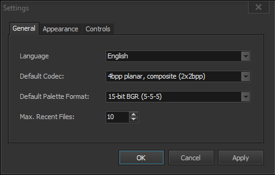

# Tile Bulinator - Manual do Usuário

Bem-vindo ao Manual do Usuário oficial do **Tile Bulinator**. Este guia fornece um passo a passo detalhado de todos os recursos e funcionalidades da aplicação.

## Índice
1.  [Introdução](#1-introduction)
2.  [A Interface Principal](#2-the-main-interface)
3.  [Primeiros Passos: Arquivos & Projetos](#3-getting-started-files--projects)
    * [Abrindo um Arquivo de ROM](#opening-a-rom-file)
    * [Trabalhando com Projetos](#working-with-projects)
4.  [A Visualização de Documento](#4-the-document-view)
    * [Painel de Controles](#controls-panel)
    * [Painel de Ferramentas](#tools-panel)
    * [Visualizações de Paleta](#palette-views)
    * [O Visualizador de Tiles](#the-tile-viewer)
5.  [Ferramentas de Edição em Detalhe](#5-editing-tools-in-detail)
6.  [Referência de Menus](#6-menu-reference)
    * [Menu Arquivo](#file-menu)
    * [Menu Editar](#edit-menu)
    * [Menu Exibir](#view-menu)
    * [Menu Paleta](#palette-menu)
    * [Menu Projeto](#project-menu)
    * [Menu Configurações](#settings-menu)
7.  [Atalhos de Teclado & Mouse](#7-keyboard--mouse-shortcuts)

---

## 1. Introdução

**Tile Bulinator** é um editor gráfico de tiles avançado, projetado para visualizar e modificar dados gráficos brutos encontrados em ROMs de consoles clássicos. Ele fornece uma interface poderosa e intuitiva para ROM hackers e entusiastas de jogos retrô explorarem e alterarem os recursos visuais do jogo diretamente.

Este manual irá guiá-lo através de seus recursos poderosos, desde a visualização básica de arquivos até a edição gráfica avançada e o gerenciamento de paletas.

## 2. A Interface Principal

A janela principal é dividida em várias áreas chave:

*(Imagem: Uma captura de tela da janela principal da aplicação com as áreas chave destacadas.)*

* **Menu Principal**: Localizado no topo, fornece acesso a todas as funções da aplicação, como operações de arquivo, comandos de edição e configurações de visualização.
* **Área de Documentos**: A parte central da janela onde os arquivos de ROM são abertos em abas. Cada aba representa uma visualização de documento independente.
* **Barra de Status**: Localizada na parte inferior, exibe informações importantes como o caminho completo do arquivo aberto, o endereço e as coordenadas sob o cursor, e o nível de zoom atual.

## 3. Primeiros Passos: Arquivos & Projetos

### Abrindo um Arquivo de ROM

Para começar, você precisa abrir um arquivo de ROM.
1.  Vá para **Arquivo > Abrir** no menu principal.
2.  Selecione um ou mais arquivos de ROM do seu computador.
3.  Cada arquivo selecionado abrirá em uma nova aba na Área de Documentos.

Quando um arquivo é aberto, ele é carregado em uma **Visualização de Documento**, que é o espaço de trabalho principal para toda a edição.

### Trabalhando com Projetos

Um **Projeto (`.tbproj`)** salva toda a sua sessão de trabalho. Isso é incrivelmente útil para hacks complexos onde você está trabalhando com múltiplos arquivos ou tem configurações de visualização muito específicas.

Um arquivo de projeto armazena:
* A lista de todos os arquivos de ROM abertos.
* As configurações específicas para cada arquivo: codec, paleta, zoom, posição de rolagem, etc.
* A aba ativa em que você estava trabalhando.

Você pode gerenciar projetos usando o menu **Projeto**. Use **Projeto > Salvar Projeto** para salvar sua sessão atual e **Projeto > Abrir Projeto** para restaurá-la mais tarde.

## 4. A Visualização de Documento

Cada aba contém uma Visualização de Documento, que é onde toda a mágica acontece. Esta visualização é autocontida e contém todas as configurações para o arquivo atualmente exibido.

*(Imagem: Uma captura de tela de uma única aba de documento com seus vários painéis destacados.)*

### Painel de Controles

Este painel permite que você defina como os dados brutos da ROM são interpretados e exibidos.

* **Codec**: Esta é a configuração mais importante. Um codec (abreviação de Codificador-Decodificador) informa ao programa como traduzir os bytes brutos da ROM em pixels. Diferentes consoles armazenam gráficos de maneiras diferentes (ex: planar, linear). Você deve selecionar o codec correto para o jogo que está editando. A lista inclui formatos como `4bpp planar, composite (2x2bpp)` para SNES ou `2bpp planar` para Game Boy.
* **Tiles por Linha/Coluna**: Estes campos numéricos controlam as dimensões do visualizador de tiles, permitindo que você organize os tiles de uma forma que faça sentido para os dados que está visualizando.
* **Formato da Paleta**: Seleciona o formato de cor para carregar paletas da ROM ou de arquivos externos (ex: `15-bit BGR (5-5-5)` é comum para SNES/GBA).

### Painel de Ferramentas

Aqui você pode selecionar sua ferramenta de edição ativa e realizar transformações em seus tiles.

                                                                                                    
*(Imagem: Um close-up do painel de Ferramentas.)*

* **Ferramentas de Edição**: Ponteiro, Lápis, Balde de Tinta, Conta-gotas, Substituidor de Cor, Zoom e Mover. Cada uma é explicada em detalhe na seção 5.
* **Botões de Transformação**: Inverter Horizontalmente (`H`), Inverter Verticalmente (`V`) e Rotacionar (`R`). Estes se aplicam a uma seleção de tiles, ou a toda a visualização se nada estiver selecionado.
* **Botões de Deslocamento**: Os botões de seta deslocam os pixels dentro de cada tile da seleção (ou de toda a visualização) em um pixel na direção escolhida.

### Visualizações de Paleta

O Tile Bulinator usa um sistema de paletas de dois níveis para máxima flexibilidade.

* **Paleta Mestra** (painel direito): Mostra a paleta mestra completa de 256 cores. Você pode carregar esta paleta da ROM (veja o **Menu Paleta**) ou de um arquivo externo. Clicar nesta paleta seleciona uma sub-paleta para usar na edição.

                                                                                                                     
    *(Imagem: Um close-up do painel da Paleta Mestra.)*
* **Paleta Ativa** (painel esquerdo): Esta é a sub-paleta atualmente em uso para desenhar. Seu tamanho é determinado pelos bits por pixel do codec selecionado (ex: um codec de 4bpp usará uma paleta ativa de 16 cores). Clicar em uma cor aqui a seleciona para desenhar. Clicar com o botão direito em uma cor permite que você a edite.

                                                                                                            
    *(Imagem: Um close-up do painel da Paleta Ativa.)*

### O Visualizador de Tiles

Esta é a tela principal onde os tiles decodificados são exibidos e editados.

                                                                                            
*(Imagem: Um close-up do painel do Visualizador de Tiles.)*

* **Navegação**: Use a barra de rolagem vertical para mover-se pelo arquivo tile por tile, e a barra de rolagem horizontal para um deslocamento mais fino em nível de byte. Você também pode usar a roda do mouse para rolar verticalmente.
* **Zoom**: A maneira mais rápida de dar zoom é segurando **Ctrl** e usando a **Roda do Mouse**.
* **Grades**: Você pode alternar uma grade de tiles de 8x8 e uma grade de pixels de 1x1 para edição precisa através do menu **Exibir**. A grade de pixels só é visível em níveis de zoom mais altos.

## 5. Ferramentas de Edição em Detalhe

Aqui está como usar cada ferramenta do Painel de Ferramentas.

*  **Ferramenta Ponteiro**: Clique e arraste para selecionar um bloco retangular de tiles. A seleção pode então ser usada para transformações, operações de copiar/recortar ou exportar.
*  **Ferramenta Lápis**: Clique em um pixel para desenhar com a cor atualmente selecionada da Paleta Ativa. Você também pode clicar e arrastar para desenhar continuamente.
    > **Atalho**: Segure **Ctrl** enquanto esta ferramenta estiver ativa para mudar temporariamente para o **Conta-gotas**.
*  **Ferramenta Balde de Tinta**:
    * **Clique Normal**: Realiza um "preenchimento global". Ele encontra todos os pixels da cor clicada que estão conectados em *toda a área de tiles visível* e os substitui pela cor ativa.
    * **Ctrl + Clique**: Realiza um "preenchimento local". O preenchimento é limitado ao único tile de 8x8 em que você clicou.
*  **Ferramenta Conta-gotas**: Clique em qualquer pixel no visualizador de tiles para selecionar sua cor e torná-la a cor ativa nas visualizações de paleta.
*  **Ferramenta Substituidor de Cor**: Substitui uma cor por outra. Clique em um pixel; sua cor se torna a cor "alvo", e todas as instâncias dela são substituídas pela cor de desenho atualmente ativa.
    > **Atalho**: Segure **Shift** ao clicar para realizar a substituição *apenas dentro da seleção atual*.
*  **Ferramenta Mover**: Permite mover uma seleção de tiles.
    1.  Primeiro, crie uma seleção com a **Ferramenta Ponteiro**.
    2.  Selecione a **Ferramenta Mover**.
    3.  Clique *dentro* da seleção e arraste-a para um novo local.
    4.  Solte o botão do mouse para soltar os tiles na nova posição.
*  **Ferramenta Zoom**:
    * **Clique com o botão esquerdo** no visualizador de tiles para ampliar (zoom in).
    * **Clique com o botão direito** para reduzir (zoom out).

## 6. Referência de Menus

### Menu Arquivo

* **Abrir**: Abre um ou mais arquivos de ROM.
* **Abrir Recentes**: Uma lista de arquivos abertos recentemente para acesso rápido.
* **Salvar**: Salva as alterações no arquivo de ROM atual.
* **Salvar Como...**: Salva o arquivo de ROM atual em um novo local.
* **Salvar Tudo**: Salva todos os arquivos modificados que estão abertos.
* **Fechar**: Fecha a aba atual. Irá perguntar se deseja salvar se houver alterações não salvas.
* **Fechar Tudo**: Tenta fechar todas as abas abertas.
* **Sair**: Fecha a aplicação.

### Menu Editar

* **Desfazer/Refazer**: Funcionalidade padrão de desfazer/refazer para suas edições.
* **Recortar/Copiar/Colar**: Copia e cola blocos de dados de tiles selecionados.
* **Exportar para PNG**: Exporta a seleção de tiles atual como um arquivo de imagem `.png`.
* **Importar de PNG**: Importa um arquivo `.png`. A imagem é convertida usando a paleta ativa atual e colada na localização da seleção.
* **Ir Para...**: Abre a caixa de diálogo "Ir para o Offset" para pular para um endereço específico no arquivo.

### Menu Exibir

* **Grade de Tiles**: Alterna a visibilidade da grade de tiles 8x8.
* **Grade de Pixels**: Alterna a visibilidade da grade de pixels 1x1.

### Menu Paleta

* **Carregar Paleta Mestra da ROM...**: Pede um offset, então tenta carregar uma paleta de 256 cores daquele endereço na ROM usando o Formato de Paleta selecionado.
* **Carregar Paleta Mestra de Arquivo...**: Carrega uma paleta mestra de um arquivo externo (ex: um arquivo `.pal`).
* **Carregar Paleta Ativa de Arquivo...**: Carrega uma pequena paleta diretamente na visualização de Paleta Ativa de um arquivo `.tbpal`.
* **Salvar Paleta Ativa...**: Salva a Paleta Ativa atual em um arquivo `.tbpal`.

### Menu Projeto

* **Novo Projeto**: Fecha todos os arquivos e inicia uma nova sessão de projeto vazia.
* **Abrir Projeto...**: Abre um arquivo `.tbproj`, restaurando todos os arquivos salvos e suas configurações.
* **Abrir Projeto Recente**: Uma lista de projetos abertos recentemente.
* **Salvar Projeto / Salvar Projeto Como...**: Salva o estado atual de todas as abas abertas e suas configurações em um arquivo `.tbproj`.
* **Fechar Projeto**: Fecha o projeto atual (funcionalmente o mesmo que Novo Projeto).

### Menu Configurações

* **Configurações...**: Abre a caixa de diálogo de configurações da aplicação, onde você pode mudar o idioma, visualizações padrão e a aparência da seleção.

                                                                                                                                                  
*(Imagem: Um close-up da janela de Configurações.)*

## 7. Atalhos de Teclado & Mouse

| Ação | Atalho | Contexto |
| :--- | :--- | :--- |
| Zoom | `Ctrl` + `Roda do Mouse` | No Visualizador de Tiles |
| Rolagem Vertical | `Roda do Mouse` | No Visualizador de Tiles |
| Conta-gotas Temporário | `Ctrl` + `Clique` | Quando a Ferramenta Lápis está ativa |
| Preenchimento Local de Tile | `Ctrl` + `Clique` | Quando a Ferramenta Balde de Tinta está ativa |
| Substituir na Seleção | `Shift` + `Clique` | Quando o Substituidor de Cor está ativo |
| Editar Cor Ativa | `Clique com o botão direito` em uma cor | Na Visualização de Paleta Ativa |

---

*Este manual foi gerado por IA com base no código-fonte da aplicação. Todos os recursos estão sujeitos a alterações.*

