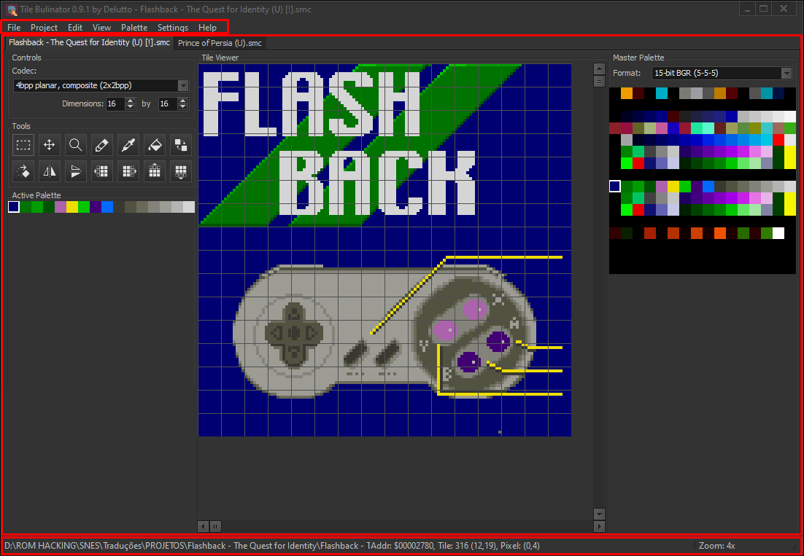
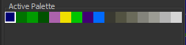

# Tile Bulinator - Kullanici Kilavuzu

**Tile Bulinator**'in resmi Kullanici Kilavuzu'na hos geldiniz. Bu kilavuz, uygulamanin tüm özellikleri ve islevleri hakkinda ayrintili bir yol haritasi sunmaktadir.

## Içindekiler
1.  [Giris](#1-introduction)
2.  [Ana Arayüz](#2-the-main-interface)
3.  [Baslarken: Dosyalar ve Projeler](#3-getting-started-files--projects)
    * [Bir ROM Dosyasi Açma](#opening-a-rom-file)
    * [Projelerle Çalisma](#working-with-projects)
4.  [Belge Görünümü](#4-the-document-view)
    * [Kontrol Paneli](#controls-panel)
    * [Araçlar Paneli](#tools-panel)
    * [Palet Görünümleri](#palette-views)
    * [Döseme Görüntüleyici](#the-tile-viewer)
5.  [Düzenleme Araçlari Detayli Anlatim](#5-editing-tools-in-detail)
6.  [Menü Referansi](#6-menu-reference)
    * [Dosya Menüsü](#file-menu)
    * [Düzen Menüsü](#edit-menu)
    * [Görünüm Menüsü](#view-menu)
    * [Palet Menüsü](#palette-menu)
    * [Proje Menüsü](#project-menu)
    * [Ayarlar Menüsü](#settings-menu)
7.  [Klavye ve Fare Kisayollari](#7-keyboard--mouse-shortcuts)

---

## 1. Giris

**Tile Bulinator**, klasik konsol ROM'larinda bulunan ham grafik verilerini görüntülemek ve degistirmek için tasarlanmis gelismis bir döseme (tile) grafik düzenleyicisidir. ROM hacker'lari ve retro oyun meraklilarinin oyun varliklarini dogrudan kesfetmeleri ve degistirmeleri için güçlü ve sezgisel bir arayüz saglar.

Bu kilavuz, temel dosya görüntülemeden gelismis grafik düzenleme ve palet yönetimine kadar güçlü özellikleri boyunca size rehberlik edecektir.

## 2. Ana Arayüz

Ana pencere birkaç ana alana ayrilmistir:

*(Resim: Anahtar alanlari vurgulanmis ana uygulama penceresinin bir ekran görüntüsü.)*

* **Ana Menü**: Üstte yer alir ve dosya islemleri, düzenleme komutlari ve görünüm ayarlari gibi tüm uygulama islevlerine erisim saglar.
* **Belge Alani**: ROM dosyalarinin sekmeler halinde açildigi pencerenin merkezi kismidir. Her sekme bagimsiz bir belge görünümünü temsil eder.
* **Durum Çubugu**: Altta yer alir ve açik dosyanin tam yolu, imlecin altindaki adres ve koordinatlar ve mevcut yakinlastirma seviyesi gibi önemli bilgileri görüntüler.

## 3. Baslarken: Dosyalar ve Projeler

### Bir ROM Dosyasi Açma

Baslamak için bir ROM dosyasi açmaniz gerekir.
1.  Ana menüden **Dosya > Aç**'a gidin.
2.  Bilgisayarinizdan bir veya daha fazla ROM dosyasi seçin.
3.  Seçilen her dosya, Belge Alani'nda yeni bir sekmede açilacaktir.

Bir dosya açildiginda, tüm düzenleme islemleri için ana çalisma alani olan bir **Belge Görünümü**'ne yüklenir.

### Projelerle Çalisma

Bir **Proje (`.tbproj`)** tüm çalisma alani oturumunuzu kaydeder. Bu, birden fazla dosyayla çalistiginiz veya çok özel görünüm ayarlarina sahip oldugunuz karmasik hack'ler için inanilmaz derecede kullanislidir.

Bir proje dosyasi sunlari saklar:
* Açik olan tüm ROM dosyalarinin listesi.
* Her dosya için özel ayarlar: codec, palet, yakinlastirma, kaydirma konumu vb.
* Üzerinde çalistiginiz aktif sekme.

Projeleri **Proje** menüsünü kullanarak yönetebilirsiniz. Mevcut oturumunuzu kaydetmek için **Proje > Projeyi Kaydet**'i ve daha sonra geri yüklemek için **Proje > Projeyi Aç**'i kullanin.

## 4. Belge Görünümü

Her sekme, tüm sihrin gerçeklestigi bir Belge Görünümü içerir. Bu görünüm kendi kendine yeterlidir ve o anda görüntülenen dosya için tüm ayarlari tutar.

*(Resim: Çesitli panelleri vurgulanmis tek bir belge sekmesinin ekran görüntüsü.)*

### Kontrol Paneli

Bu panel, ROM'dan gelen ham verilerin nasil yorumlanacagini ve görüntülenecegini tanimlamaniza olanak tanir.

* **Codec**: Bu en önemli ayardir. Bir codec (Kodlayici-Kod Çözücü'nün kisaltmasi), programa ROM'un ham baytlarini piksellere nasil çevirecegini söyler. Farkli konsollar grafikleri farkli sekillerde saklar (ör. düzlemsel, dogrusal). Düzenlediginiz oyun için dogru codec'i seçmelisiniz. Liste, SNES için `4bpp planar, composite (2x2bpp)` veya Game Boy için `2bpp planar` gibi formatlari içerir.
* **Satir/Sütun Basina Döseme**: Bu döndürme kutulari, döseme görüntüleyicinin boyutlarini kontrol ederek, dösemeleri görüntülediginiz veriler için anlamli bir sekilde düzenlemenize olanak tanir.
* **Palet Formati**: ROM'dan veya harici dosyalardan palet yüklemek için renk formatini seçer (ör. `15-bit BGR (5-5-5)` SNES/GBA için yaygindir).

### Araçlar Paneli

Burada aktif düzenleme aracinizi seçebilir ve dösemeleriniz üzerinde dönüsümler gerçeklestirebilirsiniz.

*(Resim: Araçlar panelinin yakin çekimi.)*

* **Düzenleme Araçlari**: Isaretçi, Kalem, Boya Kovasi, Damlalik, Renk Degistirici, Yakinlastirma ve Tasima. Her biri bölüm 5'te ayrintili olarak açiklanmistir.
* **Dönüsüm Dügmeleri**: Yatay Çevir (`H`), Dikey Çevir (`V`) ve Döndür (`R`). Bunlar bir döseme seçimine veya hiçbir sey seçilmemisse tüm görünüme uygulanir.
* **Kaydirma Dügmeleri**: Ok dügmeleri, seçimdeki (veya tüm görünümdeki) her dösemenin içindeki pikselleri seçilen yönde bir piksel kaydirir.

### Palet Görünümleri

Tile Bulinator, maksimum esneklik için iki seviyeli bir palet sistemi kullanir.

* **Ana Palet** (sag panel): Tam 256 renkli ana paleti gösterir. Bu paleti ROM'dan (**Palet Menüsü**'ne bakin) veya harici bir dosyadan yükleyebilirsiniz. Bu palete tiklamak, düzenleme için kullanilacak bir alt palet seçer.
    
    *(Resim: Ana Palet panelinin yakin çekimi.)*
* **Aktif Palet** (sol panel): Bu, su anda çizim için kullanilan alt palettir. Boyutu, seçilen codec'in piksel basina bit sayisina göre belirlenir (ör. 4bpp bir codec 16 renkli bir aktif palet kullanacaktir). Buradaki bir renge tiklamak, onu çizim için seçer. Bir renge sag tiklamak, onu düzenlemenizi saglar.
    
    *(Resim: Aktif Palet panelinin yakin çekimi.)*

### Döseme Görüntüleyici

Burasi, kodlari çözülmüs dösemelerin görüntülendigi ve düzenlendigi ana tuvaldir.

*(Resim: Döseme Görüntüleyici panelinin yakin çekimi.)*

* **Gezinme**: Dosya içinde döseme döseme ilerlemek için dikey kaydirma çubugunu ve ince ayarli, bayt seviyesinde kaydirma için yatay kaydirma çubugunu kullanin. Dikey olarak kaydirmak için fare tekerlegini de kullanabilirsiniz.
* **Yakinlastirma**: Yakinlastirmanin en hizli yolu **Ctrl** tusunu basili tutup **Fare Tekerlegini** kullanmaktir.
* **Izgaralar**: **Görünüm** menüsü araciligiyla hassas düzenleme için 8x8 döseme izgarasini ve 1x1 piksel izgarasini açip kapatabilirsiniz. Piksel izgarasi yalnizca daha yüksek yakinlastirma seviyelerinde görünür.

## 5. Düzenleme Araçlari Detayli Anlatim

Iste Araçlar Paneli'ndeki her bir aracin nasil kullanilacagi.

*  **Isaretçi Araci**: Dikdörtgen bir döseme blogu seçmek için tiklayin ve sürükleyin. Seçim daha sonra dönüsümler, kes/kopyala islemleri veya disa aktarma için kullanilabilir.
*  **Kalem Araci**: Aktif Palet'ten o an seçili olan renkle çizmek için bir piksele tiklayin. Sürekli çizmek için tiklayip sürükleyebilirsiniz.
    > **Kisayol**: Bu araç etkinken **Ctrl** tusunu basili tutarak geçici olarak **Damlalik**'a geçin.
*  **Boya Kovasi Araci**:
    * **Normal Tiklama**: "Genel doldurma" yapar. Tiklanan rengin *görünür tüm döseme alani boyunca* bagli olan tüm piksellerini bulur ve bunlari aktif renkle degistirir.
    * **Ctrl + Tiklama**: "Yerel doldurma" yapar. Doldurma, tikladiginiz tek 8x8 dösemeyle sinirlidir.
*  **Damlalik Araci**: Rengini seçmek ve palet görünümlerinde aktif renk yapmak için döseme görüntüleyicideki herhangi bir piksele tiklayin.
*  **Renk Degistirici Araci**: Bir rengi digeriyle degistirir. Bir piksele tiklayin; rengi "hedef" renk olur ve tüm örnekleri o anki aktif çizim rengiyle degistirilir.
    > **Kisayol**: Degistirme islemini *yalnizca mevcut seçim içinde* gerçeklestirmek için tiklarken **Shift** tusunu basili tutun.
*  **Tasima Araci**: Bir döseme seçimini tasimaniza olanak tanir.
    1.  Önce **Isaretçi Araci** ile bir seçim olusturun.
    2.  **Tasima Araci**'ni seçin.
    3.  Seçimin *içine* tiklayin ve yeni bir konuma sürükleyin.
    4.  Dösemeleri yeni konumuna birakmak için fare dügmesini serbest birakin.
*  **Yakinlastirma Araci**:
    * **Sol tiklama** ile döseme görüntüleyicide yakinlastirin.
    * **Sag tiklama** ile uzaklastirin.

## 6. Menü Referansi

### Dosya Menüsü

* **Aç**: Bir veya daha fazla ROM dosyasi açar.
* **Son Kullanilanlari Aç**: Hizli erisim için son açilan dosyalarin bir listesi.
* **Kaydet**: Degisiklikleri mevcut ROM dosyasina kaydeder.
* **Farkli Kaydet...**: Mevcut ROM dosyasini yeni bir konuma kaydeder.
* **Tümünü Kaydet**: O anda açik olan tüm degistirilmis dosyalari kaydeder.
* **Kapat**: Mevcut sekmeyi kapatir. Kaydedilmemis degisiklikler varsa kaydetmek için sorar.
* **Tümünü Kapat**: Açik olan tüm sekmeleri kapatmaya çalisir.
* **Çikis**: Uygulamayi kapatir.

### Düzen Menüsü

* **Geri Al/Yinele**: Düzenlemeleriniz için standart geri alma/yineleme islevselligi.
* **Kes/Kopyala/Yapistir**: Seçilen döseme veri bloklarini kopyalar ve yapistirir.
* **PNG olarak Disa Aktar**: Mevcut döseme seçimini bir `.png` resim dosyasi olarak disa aktarir.
* **PNG'den Içe Aktar**: Bir `.png` dosyasini içe aktarir. Görüntü, o anki aktif palet kullanilarak dönüstürülür ve seçimin konumuna yapistirilir.
* **Git...**: Dosyada belirli bir adrese atlamak için "Adrese Git" iletisim kutusunu açar.

### Görünüm Menüsü

* **Döseme Izgarasi**: 8x8 döseme izgarasinin görünürlügünü açar/kapatir.
* **Piksel Izgarasi**: 1x1 piksel izgarasinin görünürlügünü açar/kapatir.

### Palet Menüsü

* **ROM'dan Ana Palet Yükle...**: Bir adres ister, ardindan seçilen Palet Formatini kullanarak ROM'daki o adresten 256 renkli bir palet yüklemeye çalisir.
* **Dosyadan Ana Palet Yükle...**: Harici bir dosyadan (ör. bir `.pal` dosyasi) bir ana palet yükler.
* **Dosyadan Aktif Palet Yükle...**: Bir `.tbpal` dosyasindan dogrudan Aktif Palet görünümüne küçük bir palet yükler.
* **Aktif Paleti Kaydet...**: Mevcut Aktif Paleti bir `.tbpal` dosyasina kaydeder.

### Proje Menüsü

* **Yeni Proje**: Tüm dosyalari kapatir ve yeni, bos bir proje oturumu baslatir.
* **Proje Aç...**: Bir `.tbproj` dosyasi açarak kaydedilmis tüm dosyalari ve ayarlarini geri yükler.
* **Son Projeyi Aç**: Son açilan projelerin bir listesi.
* **Projeyi Kaydet / Projeyi Farkli Kaydet...**: Açik olan tüm sekmelerin ve ayarlarinin mevcut durumunu bir `.tbproj` dosyasina kaydeder.
* **Projeyi Kapat**: Mevcut projeyi kapatir (islevsel olarak Yeni Proje ile aynidir).

### Ayarlar Menüsü

* **Ayarlar...**: Dil, varsayilan görünümler ve seçim görünümünü degistirebileceginiz uygulama ayarlari iletisim kutusunu açar.

## 7. Klavye ve Fare Kisayollari

| Eylem | Kisayol | Baglam |
| :--- | :--- | :--- |
| Yakinlastirma | `Ctrl` + `Fare Tekerlegi` | Döseme Görüntüleyicide |
| Dikey Kaydirma | `Fare Tekerlegi` | Döseme Görüntüleyicide |
| Geçici Damlalik | `Ctrl` + `Tiklama` | Kalem Araci etkinken |
| Yerel Döseme Doldurma | `Ctrl` + `Tiklama` | Boya Kovasi Araci etkinken |
| Seçim Içinde Degistir | `Shift` + `Tiklama` | Renk Degistirici etkinken |
| Aktif Rengi Düzenle | Bir renge `Sag tiklama` | Aktif Palet Görünümünde |

---
*Bu kilavuz, uygulama kaynak koduna dayali olarak AI tarafindan olusturulmustur. Tüm özellikler degisebilir.*